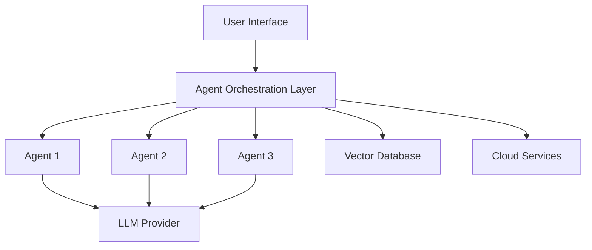

# [Project Name]

[](https://github.com/sureshkm-ai/project-name/actions)
[](https://codecov.io/gh/sureshkm-ai/project-name)
[](https://opensource.org/licenses/MIT)
[](https://www.python.org/downloads/)
[](https://github.com/psf/black)

> One-line description of your project

**Live Demo:** [https://your-demo-url.com](https://your-demo-url.com)

[Add a screenshot or GIF of your application here]

---

## 📋 Table of Contents

- [Overview](#overview)
- [Problem Statement](#problem-statement)
- [Solution](#solution)
- [Features](#features)
- [Architecture](#architecture)
- [Tech Stack](#tech-stack)
- [Getting Started](#getting-started)
- [Usage](#usage)
- [API Documentation](#api-documentation)
- [Deployment](#deployment)
- [Testing](#testing)
- [Performance](#performance)
- [Roadmap](#roadmap)
- [Contributing](#contributing)
- [License](#license)
- [Acknowledgments](#acknowledgments)
- [Contact](#contact)

---

## 🎯 Overview

Brief overview of what this project does and why it exists.

### Key Highlights
- 🚀 Feature 1
- 💡 Feature 2
- ⚡ Feature 3

---

## 🔍 Problem Statement

Describe the problem this project solves. What pain points does it address?

### Current Challenges
- Challenge 1
- Challenge 2
- Challenge 3

---

## 💡 Solution

How does this project solve the problem? What makes it unique?

### Approach
Explain your approach to solving the problem.

### Innovation
What's innovative about your solution?

---

## ✨ Features

### Core Features
- **Feature 1:** Description
- **Feature 2:** Description
- **Feature 3:** Description

### Advanced Features
- **Advanced Feature 1:** Description
- **Advanced Feature 2:** Description

### Upcoming Features
See our [Roadmap](#roadmap) for planned features.

---

## 🏗️ Architecture

### High-Level Architecture


### Component Diagram

[Add detailed architecture diagram]

### Data Flow

1. User input → Agent orchestration
2. Agent processing → Tool calls
3. LLM reasoning → Response generation
4. State management → Response delivery

---

## 🛠️ Tech Stack

### Core Technologies
- **Agent Framework:** LangGraph 1.0+
- **LLM Integration:** LangChain 1.2+
- **LLM Provider:** [OpenAI / Anthropic / Vertex AI]
- **Language:** Python 3.11+

### Cloud Platform
- **Platform:** [GCP / AWS / Azure]
- **Compute:** [Cloud Run / Lambda / Container Apps]
- **Database:** [Firestore / DynamoDB / Cosmos DB]
- **Storage:** [Cloud Storage / S3 / Blob Storage]

### Data & ML
- **Vector Database:** [ChromaDB / Pinecone / Weaviate]
- **Embeddings:** [OpenAI / Vertex AI]

### Frontend
- **Framework:** Streamlit 1.5+
- **Alternative:** FastAPI + React (optional)

### DevOps
- **Containerization:** Docker
- **CI/CD:** GitHub Actions
- **Monitoring:** LangSmith, Cloud Logging
- **IaC:** [Terraform / Pulumi]

### Development Tools
- **Package Management:** Poetry
- **Environment:** Conda + Poetry hybrid
- **Code Quality:** Black, Flake8, MyPy, isort
- **Testing:** pytest, pytest-asyncio

---

## 🚀 Getting Started

### Prerequisites

- Python 3.11 or higher
- [Conda](https://docs.conda.io/en/latest/miniconda.html) (Miniconda recommended)
- [Poetry](https://python-poetry.org/docs/#installation) (via pipx)
- [Cloud Platform Account] (GCP/AWS/Azure)
- API Keys (OpenAI/Anthropic)

### Installation

#### 1. Clone the Repository
```bash
git clone https://github.com/sureshkm-ai/project-name.git
cd project-name
```

#### 2. Set Up Environment
```bash
# Create conda environment
conda create -n project-name python=3.11 -y
conda activate project-name

# Install ML/DS dependencies via conda
conda install -y numpy pandas scipy scikit-learn jupyter matplotlib

# Install Python dependencies via Poetry
poetry install

# For specific cloud platform
poetry install --extras gcp  # or aws, azure
```

#### 3. Configure Environment Variables
```bash
# Copy environment template
cp .env.example .env

# Edit .env and add your API keys
nano .env
```

Required environment variables:
```bash
OPENAI_API_KEY=your-key
ANTHROPIC_API_KEY=your-key
LANGCHAIN_API_KEY=your-key
GCP_PROJECT_ID=your-project  # or AWS/Azure credentials
```

#### 4. Set Up Cloud Resources

**For GCP:**
```bash
# Authenticate
gcloud auth login
gcloud config set project YOUR_PROJECT_ID

# Enable APIs
gcloud services enable run.googleapis.com aiplatform.googleapis.com firestore.googleapis.com

# Create service account
gcloud iam service-accounts create agentic-ai-sa
```

**For AWS:**
```bash
# Configure AWS CLI
aws configure
```

**For Azure:**
```bash
# Login to Azure
az login
```

#### 5. Initialize Database
```bash
# Run initialization script
python scripts/setup.sh
```

---

## 📖 Usage

### Running Locally

#### Option 1: Streamlit App
```bash
# Activate environment
conda activate project-name

# Run Streamlit app
streamlit run app/main.py

# Or use make command
make run-local
```

Access at: http://localhost:8080

#### Option 2: FastAPI Server
```bash
# Run API server
uvicorn app.main:app --reload --host 0.0.0.0 --port 8000

# Or use make command
make run-api
```

API docs at: http://localhost:8000/docs

#### Option 3: Docker
```bash
# Build and run with Docker Compose
docker-compose up -d

# View logs
docker-compose logs -f

# Stop
docker-compose down
```

### Example Usage
```python
from src.graph.main_graph import MainGraph
from src.utils.config import settings

# Initialize graph
graph = MainGraph()

# Run agent
result = await graph.run({
    "input": "Your query here",
    "context": {}
})

print(result["final_response"])
```

---

## 📚 API Documentation

### Endpoints

#### `POST /api/chat`
Process user message through agent system.

**Request:**
```json
{
  "message": "string",
  "session_id": "string",
  "context": {}
}
```

**Response:**
```json
{
  "response": "string",
  "session_id": "string",
  "metadata": {}
}
```

#### `GET /api/health`
Health check endpoint.

**Response:**
```json
{
  "status": "healthy",
  "version": "1.0.0"
}
```

See full API documentation at `/docs` when running the server.

---

## 🚢 Deployment

### Deploy to GCP Cloud Run
```bash
# Using Make
make deploy-gcp

# Or manually
gcloud run deploy project-name \
  --source . \
  --platform managed \
  --region us-central1 \
  --allow-unauthenticated
```

### Deploy to AWS Lambda
```bash
# Package application
zip -r function.zip src/ requirements.txt

# Deploy
aws lambda update-function-code \
  --function-name project-name \
  --zip-file fileb://function.zip
```

### Deploy to Azure
```bash
# Deploy container
az webapp up \
  --name project-name \
  --resource-group agentic-ai-rg \
  --location eastus
```

### CI/CD

This project uses GitHub Actions for automated deployment.

- **CI:** Runs on every push/PR (linting, testing, security)
- **CD:** Deploys to cloud on merge to `main`

See `.github/workflows/` for details.

---

## 🧪 Testing

### Run All Tests
```bash
# Run full test suite
make test

# Or manually
pytest tests/ -v --cov=src
```

### Run Specific Tests
```bash
# Unit tests only
pytest tests/unit/

# Integration tests
pytest tests/integration/

# E2E tests
pytest tests/e2e/

# With coverage
pytest --cov=src --cov-report=html
```

### Test Coverage

Current test coverage: **XX%** (target: 80%+)

View coverage report: `htmlcov/index.html`

---

## 📊 Performance

### Metrics

- **Response Time:** < 2 seconds (p95)
- **Throughput:** 100+ requests/second
- **Accuracy:** XX%
- **Uptime:** 99.9%

### Benchmarks
```
Agent Processing: 1.2s avg
LLM Latency: 800ms avg
Total Response Time: 2.0s avg
```

### Optimization

- Caching: Redis for frequently accessed data
- Async processing: All I/O operations
- Connection pooling: Database connections
- Batch processing: Multiple requests

---

## 🗺️ Roadmap

### Version 1.0 (Current)
- [x] Core agent system
- [x] Basic UI
- [x] Cloud deployment
- [x] CI/CD pipeline

### Version 1.1 (Next)
- [ ] Advanced analytics
- [ ] Multi-language support
- [ ] Performance optimizations
- [ ] Enhanced monitoring

### Version 2.0 (Future)
- [ ] Multi-modal support
- [ ] Advanced reasoning
- [ ] Fine-tuned models
- [ ] Enterprise features

See [Issues](https://github.com/sureshkm-ai/project-name/issues) for detailed tasks.

---

## 🤝 Contributing

Contributions are welcome! Please read our [Contributing Guide](CONTRIBUTING.md) first.

### How to Contribute

1. Fork the repository
2. Create your feature branch (`git checkout -b feature/amazing-feature`)
3. Commit your changes (`git commit -m 'feat: add amazing feature'`)
4. Push to the branch (`git push origin feature/amazing-feature`)
5. Open a Pull Request

### Code Style

This project uses:
- **Black** for code formatting
- **isort** for import sorting
- **Flake8** for linting
- **MyPy** for type checking

Run before committing:
```bash
make format
make lint
```

---

## 📄 License

This project is licensed under the MIT License - see the [LICENSE](LICENSE) file for details.

---

## 🙏 Acknowledgments

- **LangChain & LangGraph** - Agent framework
- **Anthropic/OpenAI** - LLM providers
- **[Cloud Provider]** - Infrastructure
- Inspired by [relevant papers/projects]

---

## 👤 Author

**Suresh Kumar Maddala**

- GitHub: [@sureshkm-ai](https://github.com/sureshkm-ai)
- LinkedIn: [Your LinkedIn](https://linkedin.com/in/yourprofile)
- Portfolio: [Your Portfolio](https://yourportfolio.com)
- Email: msk88.in@gmail.com

---

## 📞 Contact

Have questions or suggestions?

- Open an [Issue](https://github.com/sureshkm-ai/project-name/issues)
- Start a [Discussion](https://github.com/sureshkm-ai/project-name/discussions)
- Email: msk88.in@gmail.com

---

## ⭐ Support

If you found this project helpful, please give it a ⭐!

---

**Built with ❤️ as part of the Agentic AI Mastery Journey**

*Last Updated: December 2025*
