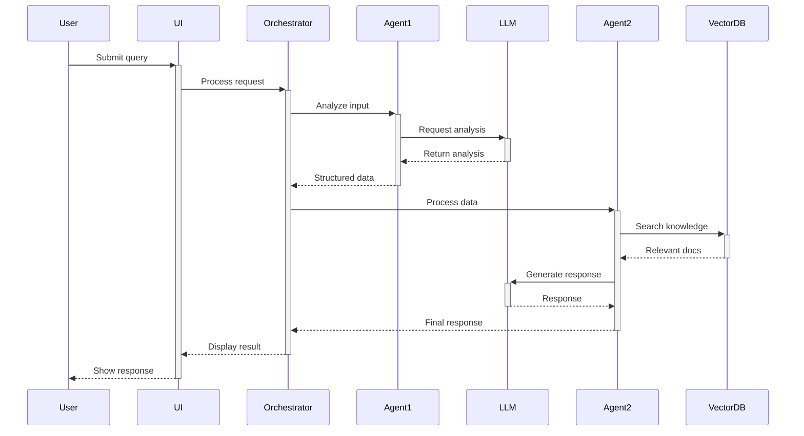

# Architecture Documentation

## System Overview

[High-level description of the system architecture]

## Components

### 1. Agent Layer

#### Symptom Analyzer Agent
- **Purpose:** Analyze user-reported symptoms
- **Input:** Natural language symptom description
- **Output:** Structured symptom data
- **Technology:** LangChain + Vertex AI

#### [Other Agents]
- Description

### 2. Orchestration Layer

#### LangGraph Workflow
- **Purpose:** Coordinate agent execution
- **Pattern:** Supervisor + Worker pattern
- **State Management:** Shared state across agents

### 3. Data Layer

#### Vector Database
- **Technology:** ChromaDB
- **Purpose:** Semantic search for medical knowledge
- **Indexing:** Automatic embedding generation

#### Firestore
- **Purpose:** Conversation history storage
- **Schema:** Document per session

### 4. Integration Layer

#### LLM Providers
- Primary: Anthropic Claude 3.5 Sonnet
- Fallback: OpenAI GPT-4
- Access: Via Vertex AI

#### Cloud Services
- Compute: Cloud Run
- Storage: Cloud Storage
- Database: Firestore

## Data Flow

## Security Architecture

### Authentication
- API key-based authentication
- Rate limiting per user/IP
- Request validation

### Data Protection
- Encryption at rest (Cloud Storage, Firestore)
- Encryption in transit (TLS 1.3)
- No PII storage (anonymized data only)

### Compliance
- HIPAA considerations (for healthcare projects)
- GDPR compliance
- SOC 2 Type II alignment

## Scalability

### Horizontal Scaling
- Cloud Run auto-scaling (0-100 instances)
- Load balancing across instances
- Stateless design

### Performance Optimization
- Redis caching for frequent queries
- Connection pooling
- Async I/O operations
- Batch processing

## Monitoring & Observability

### Metrics
- Request latency (p50, p95, p99)
- Error rate
- Agent execution time
- LLM token usage

### Logging
- Structured logging (JSON format)
- Log aggregation (Cloud Logging)
- Error tracking (Sentry)

### Tracing
- LangSmith for agent execution traces
- Cloud Trace for distributed tracing
- Custom span annotations

## Disaster Recovery

### Backup Strategy
- Firestore: Automated daily backups
- Cloud Storage: Versioning enabled
- Configuration: Infrastructure as Code (Terraform)

### Recovery Plan
- RTO (Recovery Time Objective): < 1 hour
- RPO (Recovery Point Objective): < 1 hour
- Automated failover to backup region

## Future Enhancements

1. **Multi-Region Deployment**
   - Primary: us-central1
   - Replica: europe-west1

2. **Advanced Caching**
   - Semantic caching for similar queries
   - Response caching with TTL

3. **Federated Learning**
   - Privacy-preserving model updates
   - Distributed training

---

Last Updated: December 2025
